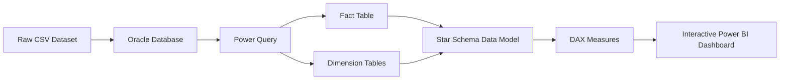
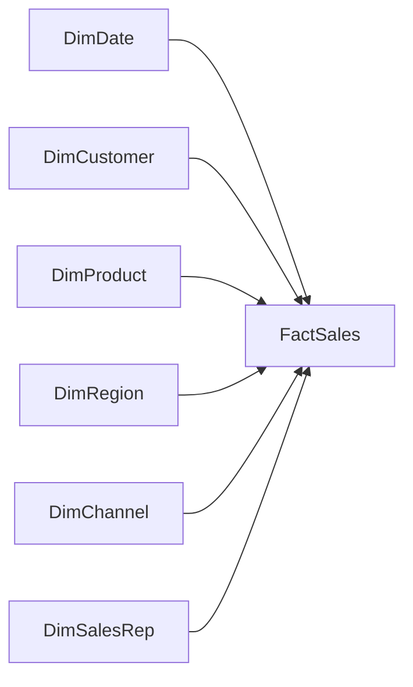

# Power-BI-Sales-Dashboard-
Interactive Power BI sales dashboard built with Oracle, Power Query, DAX and a Star Schema data model.
An end-to-end Business Intelligence project demonstrating the complete workflow from raw sales data to an interactive Power BI dashboard.

---

# 🚀 Project Overview

This project demonstrates how raw sales data can be transformed into meaningful business insights using Oracle Database, Power Query, DAX, and Star Schema modeling.

The objective was to build a professional Power BI dashboard that enables users to analyze sales performance through interactive reports and business KPIs.

---

# 🛠️ Technologies Used

- Oracle Database
- SQL Developer
- Power BI Desktop
- Power Query
- DAX (Data Analysis Expressions)
- Star Schema Data Modeling
- Git & GitHub

---

# 📈 Business Workflow



---

# ⭐ Project Features

### Data Storage

- Imported raw sales data into an Oracle Database
- Connected Oracle Database to Power BI

### Data Preparation

- Created reference queries in Power Query
- Removed unnecessary columns
- Removed duplicate records from dimension tables
- Validated data types

### Data Modeling

Created a Star Schema consisting of:

**Fact Table**

- Fact_Sales

**Dimension Tables**

- DimDate
- DimCustomer
- DimProduct
- DimRegion
- DimChannel
- DimSalesRep

---

# 🗂️ Data Model



---

# 📊 DAX Measures

The dashboard includes several business KPIs created with DAX.

- Total Sales
- Total Profit
- Total Cost
- Total Quantity
- Profit Margin
- Return Rate
- Average Order Value
- Average Satisfaction
- Latest Refresh Date

---

# 📈 Dashboard Pages

## Executive Dashboard

Provides an overview of the company's overall business performance.

Includes:

- KPI Cards
- Sales by Category
- Sales by Sales Channel
- Profit by Region
- Interactive Slicers

---

## Sales Analysis

Provides more detailed business insights.

Includes:

- Monthly Sales Trend
- Top Products by Sales
- Sales by Customer Segment

---

# 📌 Business Questions Answered

The dashboard helps answer questions such as:

- Which product categories generate the highest revenue?
- Which sales channels perform best?
- Which regions are most profitable?
- How does sales performance change over time?
- Which customer segments generate the highest revenue?
- What is the average order value?
- What is the company's profit margin?
- How high is the return rate?

---

# 🖼️ Dashboard Preview

## Executive Dashboard


---

## Sales Analysis


---

## Star Schema Data Model


---

# 📁 Repository Structure

```text
powerbi-sales-dashboard/

│
├── README.md
├── SalesDashboard.pbix
│
├── data
│   └── business_sales_raw_data.csv
│
├── images
│   ├── dashboard_page1.png
│   ├── dashboard_page2.png
│   └── data_model.png
```

---

# 🎯 Skills Demonstrated

This project demonstrates practical experience with:

- SQL Databases
- Oracle Database
- Power Query ETL
- Star Schema Modeling
- Data Modeling
- DAX
- Interactive Dashboard Design
- Business Intelligence
- Data Visualization

---

# 📚 Key Learnings

Through this project I gained hands-on experience in the complete Business Intelligence workflow:

- Importing business data into Oracle Database
- Connecting Oracle with Power BI
- Performing ETL using Power Query
- Designing a Star Schema
- Creating business KPIs with DAX
- Developing an interactive management dashboard
- Documenting projects using GitHub

---

# 👨‍💻 Author

Created as part of my Business Intelligence & Data Analytics portfolio.
